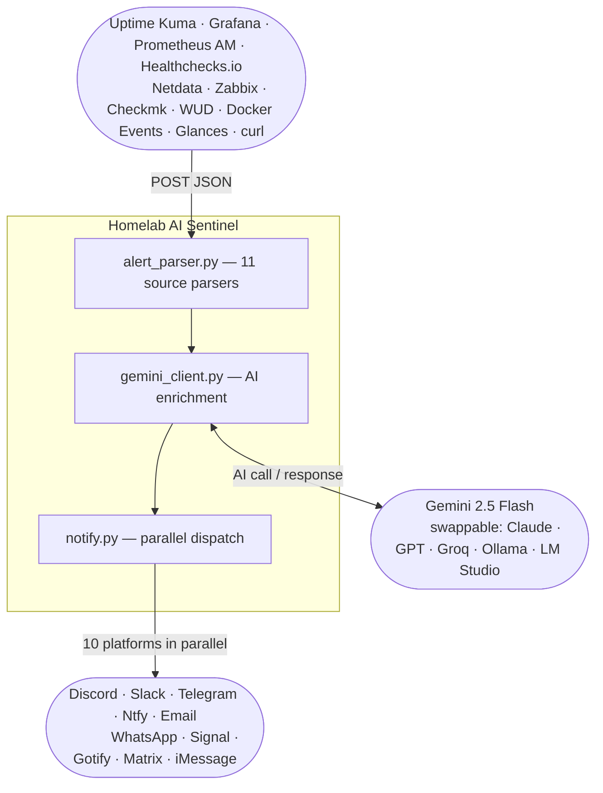

# Homelab AI Sentinel

**AI-powered alert enrichment for your homelab — turns raw monitoring webhooks into actionable notifications on Discord, Slack, Telegram, Ntfy, Email, WhatsApp, Signal, Gotify, Matrix, and iMessage (via Bluebubbles).**


---

## Architecture



**Sentinel receives a webhook → AI diagnoses the alert → you get a rich notification with what happened, why, and what to check first. The AI never touches your systems.**

- **10 notification platforms** — Discord, Slack, Telegram, Ntfy, Email, WhatsApp, Signal, Gotify, Matrix, iMessage — configure any combination, all optional
- **11 alert source parsers** — Uptime Kuma, Grafana, Prometheus, Healthchecks.io, Netdata, Zabbix, Checkmk, WUD, Docker Events, Glances, generic JSON — auto-detected, no configuration required
- **Zero system access** — Sentinel is stateless and read-only. It receives a JSON payload, calls an AI API, and sends text to your notification platform. The AI cannot restart services, run commands, read your filesystem, or take any action whatsoever. Worst case: a bad AI response sends you down the wrong debugging path for five minutes.
- **Swappable AI** — change one file to use Claude, GPT-4o, Groq, Ollama, or any local model
- **Free to run** — Gemini 2.5 Flash free tier is sufficient for homelab alert volumes
- **297 tests**, production-hardened: auth, deduplication, rate limiting, retry/backoff, graceful fallback

---

## Quick Start

```bash
git clone https://github.com/yourusername/homelab-ai-sentinel.git
cd homelab-ai-sentinel
cp .secrets.env.example .secrets.env
```

Edit `.secrets.env` — only `GEMINI_TOKEN` is required. Get a free key at [aistudio.google.com](https://aistudio.google.com) → Get API key. Add at least one notification platform (e.g. `DISCORD_WEBHOOK_URL`).

```bash
docker compose up -d
```

Test it:

```bash
curl -s http://localhost:5000/health
# {"status": "ok"}

curl -s -X POST http://localhost:5000/webhook \
  -H "Content-Type: application/json" \
  -d '{"service": "nginx", "status": "down", "message": "Connection refused on port 80"}'
```

After any file or config change: `docker compose up -d --build` (not just `restart` — that reuses the old image).

---

## Prerequisites

| Requirement | Notes |
|---|---|
| Docker + Docker Compose | Docker Desktop or standalone `docker compose` plugin |
| Google AI Studio account | Free — no billing required for Gemini 2.5 Flash |
| At least one notification platform | Discord, Slack, Telegram, Ntfy, Email, WhatsApp, Signal, Gotify, Matrix, or iMessage |

---

## Environment Variables

| Variable | Required | Default | Description |
|---|---|---|---|
| `GEMINI_TOKEN` | Yes | — | Google AI Studio API key. |
| `DISCORD_WEBHOOK_URL` | No | — | Discord webhook URL for the target channel. |
| `SLACK_WEBHOOK_URL` | No | — | Slack incoming webhook URL. |
| `TELEGRAM_BOT_TOKEN` | No | — | Telegram bot token from BotFather. |
| `TELEGRAM_CHAT_ID` | No | — | Telegram chat ID to send alerts to. |
| `NTFY_URL` | No | — | Ntfy topic URL, e.g. `https://ntfy.sh/your-topic`. |
| `SMTP_HOST` | No | — | SMTP server hostname. Required for email. |
| `SMTP_PORT` | No | `587` | SMTP port. 587 for STARTTLS, 465 for SSL. |
| `SMTP_USER` | No | — | SMTP login username. |
| `SMTP_PASSWORD` | No | — | SMTP password or app password. |
| `SMTP_TO` | No | `SMTP_USER` | Alert recipient address. |
| `WHATSAPP_TOKEN` | No | — | Meta WhatsApp Cloud API access token. |
| `WHATSAPP_PHONE_ID` | No | — | Sender Phone Number ID from Meta dashboard. |
| `WHATSAPP_TO` | No | — | Recipient number in international format, e.g. `15551234567`. |
| `SIGNAL_API_URL` | No | — | signal-cli-rest-api URL, e.g. `http://signal-cli-rest-api:8080`. |
| `SIGNAL_SENDER` | No | — | Signal phone number (the linked account). |
| `SIGNAL_RECIPIENT` | No | — | Signal phone number to send alerts to. |
| `GOTIFY_URL` | No | — | Gotify server URL. |
| `GOTIFY_APP_TOKEN` | No | — | Gotify application token. |
| `MATRIX_HOMESERVER` | No | — | Matrix homeserver URL. |
| `MATRIX_ACCESS_TOKEN` | No | — | Matrix bot user access token. |
| `MATRIX_ROOM_ID` | No | — | Matrix room ID, e.g. `!abc123:your-server`. |
| `IMESSAGE_URL` | No | — | Bluebubbles server URL (requires Mac). |
| `IMESSAGE_PASSWORD` | No | — | Bluebubbles server password. |
| `IMESSAGE_TO` | No | — | Recipient in chatGuid format: `iMessage;-;+15551234567`. |
| `PORT` | No | `5000` | Port Sentinel binds to inside the container. |
| `DISCORD_DISABLED` | No | `false` | Set `true` to suppress that platform without removing config. All 10 platforms support `{PLATFORM}_DISABLED`. |
| `SENTINEL_DEBUG` | No | `false` | Verbose logging: full parsed alert, AI response, per-platform results. Never enable in production. |
| `WEBHOOK_SECRET` | No | — | Shared secret for `X-Webhook-Token` header auth. Recommended for internet-facing deployments. Generate: `openssl rand -hex 32` |
| `WEBHOOK_RATE_LIMIT` | No | `0` | Max requests per `WEBHOOK_RATE_WINDOW` seconds. `0` disables. |
| `WEBHOOK_RATE_WINDOW` | No | `60` | Sliding window size in seconds for `WEBHOOK_RATE_LIMIT`. |
| `DEDUP_TTL_SECONDS` | No | `60` | Suppress identical alerts (same service + status + message) within this window. `0` disables. |
| `GEMINI_RPM` | No | `10` | Max Gemini API calls per minute. Default matches free tier. `0` disables. |
| `GEMINI_RETRIES` | No | `2` | Retries on 429/5xx from the AI API. Uses exponential backoff. |
| `GEMINI_RETRY_BACKOFF` | No | `1.0` | Base backoff seconds. Doubles each attempt: 1s → 2s → 4s. |
| `WORKERS` | No | cpu+1 | Gunicorn worker processes. Auto-detected from `cpu_count + 1`. |
| `WORKER_THREADS` | No | `4` | Threads per worker. Each thread handles one concurrent request. |
| `GUNICORN_MAX_REQUESTS` | No | `1000` | Recycle workers after N requests. Prevents memory growth. |
| `GUNICORN_TIMEOUT` | No | `60` | Worker timeout in seconds. Must exceed worst-case request time (~45s). |
| `GUNICORN_ACCESS_LOG` | No | — | Set to `"-"` to log per-request access logs to stdout. |

---

## Alert Sources

Auto-detected from the payload — no configuration required. Point your monitoring tool at `http://your-host:5000/webhook`.

| Source | Detection |
|---|---|
| Uptime Kuma | `heartbeat` + `monitor` fields |
| Grafana Unified Alerting | `alerts` array + `orgId` |
| Prometheus Alertmanager | `alerts` array + `receiver` + `groupLabels` (no `orgId`) |
| Healthchecks.io | `check_id` + `slug` |
| Netdata | `alarm` + `chart` + `hostname` |
| Zabbix | `trigger_name` + `trigger_severity` |
| Checkmk | `NOTIFICATIONTYPE` + `HOSTNAME` (ALL_CAPS keys) |
| WUD (What's Up Docker) | `updateAvailable` + `image` |
| Docker Events / Portainer | `Type` + `Action` + `Actor` (capital keys) |
| Glances | `glances_host` + `glances_type` (via poller sidecar) |
| Generic JSON | Any payload — looks for `service`/`name`, `status`/`state`, `message`/`msg` |

Any monitoring tool that POSTs JSON works out of the box via the generic parser. Extra fields are passed to the AI as context — the more detail you include, the better the analysis.

**Uptime Kuma:** Settings → Notifications → Webhook → Post URL: `http://your-sentinel-host:5000/webhook`

**Grafana:** Alerting → Contact points → Webhook → URL: `http://your-sentinel-host:5000/webhook`

**Prometheus Alertmanager:**
```yaml
receivers:
  - name: sentinel
    webhook_configs:
      - url: http://your-sentinel-host:5000/webhook
```

---

## Switching AI Providers

The AI integration lives entirely in `app/gemini_client.py`. Change that one file — everything else is unchanged. `get_ai_insight()` must return `{"insight": str, "suggested_actions": list[str]}`.

| Provider | Free tier | Notes |
|---|---|---|
| **Gemini 2.5 Flash** (default) | Yes | Free: 10 RPM, 500 RPD. [aistudio.google.com](https://aistudio.google.com) |
| **Claude (Anthropic)** | No | Paid API. `claude-haiku-4-5-20251001` for speed/cost. |
| **GPT-4o / GPT-4o-mini** | No | Paid API. `gpt-4o-mini` recommended for cost. |
| **Groq** | Yes | Hosted Llama 3, ~500ms latency. [console.groq.com](https://console.groq.com) |
| **Ollama** | N/A | Local. No data leaves your machine. OpenAI-compatible API. |
| **LM Studio / LocalAI** | N/A | Local. OpenAI-compatible at `localhost:1234/v1`. |

Full swap examples (Claude, GPT, Groq, Ollama, vLLM): **Homelab AI Blueprint** at [gumroad.com/thebadger1337](https://gumroad.com/thebadger1337).

---

## Security

See [SECURITY.md](SECURITY.md) for the full threat model, secrets handling, Docker isolation, and network security guidance.

**Checklist:**
- `.secrets.env` is excluded from git — verify: `git check-ignore -v .secrets.env`
- Set `WEBHOOK_SECRET` for any deployment reachable outside localhost
- Alert payloads are sent to cloud AI providers — avoid including passwords, PII, or regulated data
- Never set `FLASK_DEBUG=1` in production

---

## Running Tests

297 tests cover all 11 parsers, all 10 notification clients, parallel dispatch, rate limiting, retry/backoff, Flask error handlers, webhook auth, and deduplication. No network access required.

```bash
python3 -m venv .venv && source .venv/bin/activate
pip install -r requirements-dev.txt
python -m pytest tests/ -v
```

Expected: `297 passed`

---

## Guides & Support

**Platform Setup Guides** (production gotchas, exact error fixes, not just docs rewrites):

| Guide | Price |
|---|---|
| WhatsApp Cloud API | $15 |
| Signal | $12 |
| Matrix (Conduit) | $12 |
| iMessage (Bluebubbles) | $12 |
| Telegram | $9 |
| Gotify | $9 |
| Discord + Slack + Ntfy + Email | $9 |

**Bundles:**

| Bundle | Includes | Price |
|---|---|---|
| Messaging Power Pack | WhatsApp + Signal + Telegram + Matrix | $39 |
| Self-Hosted Stack | Gotify + Matrix + Ntfy + Discord | $29 |
| **Homelab AI Blueprint** | All platform guides + monitoring stack (Uptime Kuma, Grafana, Prometheus, Netdata, Glances) + Docker networking + full AI agent layer + LLM provider swap guide + production deployment playbook | $59 |

All guides: [gumroad.com/thebadger1337](https://gumroad.com/thebadger1337)

**Community:**
- GitHub Issues — bug reports and feature requests
- GitHub Discussions — deployment help, share your setup

---

## Roadmap

**v1.0 (complete):**
- 11 alert source parsers, 10 notification platforms, parallel dispatch (ThreadPoolExecutor)
- Alert deduplication, webhook auth (WEBHOOK_SECRET), webhook rate limiter, AI RPM rate limiter
- AI retry with exponential backoff, gthread gunicorn workers (CPU-adaptive), 297 tests

**Planned:**
- Teams, Pushover, PagerDuty notification targets
- Nagios, LibreNMS, Proxmox VE, TrueNAS, Home Assistant parsers
- Per-service severity thresholds — suppress info-level alerts from noisy monitors
- Persistent alert log (SQLite)
- Web UI — recent alerts dashboard

---

## License

MIT. See [LICENSE](LICENSE).
