<div align="center">

# 🛡️ Homelab AI Sentinel

### Your monitoring stack fires a webhook. Sentinel fires back with a diagnosis.

[](https://www.python.org/)
[](https://www.docker.com/)
[](LICENSE)
[](https://aistudio.google.com)

</div>

---

## The Hook

A service goes down. Your monitoring tool fires a JSON webhook. Without Sentinel, you get a raw payload — or at best a ping. With Sentinel, you get this:

<table>
<tr>
<td width="50%"><b>📥 Raw Webhook In</b></td>
<td width="50%"><b>📤 AI-Enriched Notification Out</b></td>
</tr>
<tr>
<td>

```json
{
  "monitor": {
    "name": "nginx"
  },
  "heartbeat": {
    "status": 0,
    "msg": "Connection refused"
  }
}
```

</td>
<td>

```
🔴 [CRITICAL] nginx — DOWN

Alert: Connection refused on port 80
Source: Uptime Kuma

🤖 AI Insight
nginx has stopped accepting connections.
This is typically a process crash, a failed
reload after a config change, or port
exhaustion. The clean refusal suggests the
process is not running rather than overloaded.

⚡ Suggested Actions
• systemctl status nginx
• journalctl -u nginx -n 50 --no-pager
• ss -tlnp | grep :80
```

</td>
</tr>
</table>

**The AI never touches your systems.** It reads alert data and outputs text. That's the entire scope of its access.

---

## What It Does

| | |
|---|---|
| 🤖 **Discord Bot Included** | `bot/` — reference Discord bot that connects to any OpenAI-compatible backend (Ollama, LM Studio, OpenAI). Chat, context, `!clear`. Full-featured version with voice, weather, and tool integration in the [setup guide](#premium-guides). |
| 🔔 **10 Notification Platforms** | Discord · Slack · Telegram · Ntfy · Email · WhatsApp · Signal · Gotify · Matrix · iMessage — configure any combination, all optional |
| 🔍 **11 Alert Source Parsers** | Uptime Kuma · Grafana · Prometheus · Healthchecks.io · Netdata · Zabbix · Checkmk · WUD · Docker Events · Glances · Generic JSON — auto-detected, zero config |
| 🤖 **AI Enrichment** | **Gemini 2.5 Flash** by default (free tier sufficient for homelab volumes) — swap to Claude, GPT-4o, Groq, or Ollama by changing one file |
| 🔒 **Zero System Access** | Stateless and read-only. Sentinel receives JSON, calls an AI API, sends text. The AI cannot restart services, run commands, or read your filesystem |
| 🧪 **Production-Hardened** | HMAC auth · deduplication · global rate limiting · retry/backoff · graceful fallback · SSRF protection · secret redaction · prompt injection detection · security audit log |
| 💸 **Free to Run** | Defaults to Gemini 2.5 Flash (free tier: 10 RPM, 500 req/day) — swap to Claude, GPT-4o, Groq, or run fully local with Ollama or LM Studio — no data leaves your machine |

---

## Architecture

```mermaid
flowchart LR
    subgraph SRC["📡 Alert Sources — 11 parsers"]
        direction TB
        s1["Uptime Kuma · Grafana"]
        s2["Prometheus · Healthchecks.io"]
        s3["Netdata · Zabbix · Checkmk"]
        s4["WUD · Docker Events · Glances · curl"]
    end

    subgraph CORE["🛡️ Homelab AI Sentinel"]
        direction TB
        P["Parser\nalert_parser.py"]
        G["AI Enrichment\ngemini_client.py"]
        N["Dispatch\nnotify.py"]
        P --> G --> N
    end

    subgraph PROVIDERS["🧠 AI Provider"]
        AI["Gemini 2.5 Flash  ·  default\nClaude · GPT · Groq · Ollama · LM Studio"]
    end

    subgraph DEST["📬 Notification Platforms — 10 targets"]
        direction TB
        d1["Discord · Slack · Telegram"]
        d2["Ntfy · Email · WhatsApp"]
        d3["Signal · Gotify · Matrix · iMessage"]
    end

    SRC  -->|"POST /webhook"| P
    G   -.->|"AI request"| PROVIDERS
    PROVIDERS -.->|"insight + actions"| G
    N   ==>|"parallel dispatch"| DEST

    style CORE fill:#0f172a,stroke:#6d28d9,stroke-width:3px,color:#e2e8f0
    style P fill:#1e293b,stroke:#6d28d9,color:#e2e8f0
    style G fill:#4c1d95,stroke:#7c3aed,stroke-width:2px,color:#ffffff
    style N fill:#1e293b,stroke:#6d28d9,color:#e2e8f0
    style SRC fill:#0f1f0f,stroke:#16a34a,color:#e2e8f0
    style PROVIDERS fill:#1c1007,stroke:#f97316,color:#e2e8f0
    style DEST fill:#0f172a,stroke:#2563eb,color:#e2e8f0
```

<details>
<summary><b>🗺️ System Diagram — click to expand</b></summary>

<br>



**Solid lines** — primary data path · **Dotted lines** — AI API call · **Thick lines** — final notification output

</details>

---

## Quick Start

```bash
git clone https://github.com/thebadger1337/homelab-ai-sentinel.git
cd homelab-ai-sentinel
cp .secrets.env.example .secrets.env
```

Edit `.secrets.env` — only **`GEMINI_TOKEN`** is required. Get a free key at [aistudio.google.com](https://aistudio.google.com) → Get API key. Add at least one notification platform (e.g. `DISCORD_WEBHOOK_URL`).

```bash
docker compose up -d
```

**Verify:**

```bash
curl -s http://localhost:5000/health
# {
#   "status": "ok",
#   "db": {"total_alerts": 0, "notified_count": 0, "last_alert_ts": null},
#   "ai": {"limit": 10, "used": 0},
#   "security": {},
#   "workers": "1"
# }

curl -s -X POST http://localhost:5000/webhook \
  -H "Content-Type: application/json" \
  -d '{"service": "nginx", "status": "down", "message": "Connection refused on port 80"}'
```

> **After any config or code change:** `docker compose up -d --build` — `restart` reuses the old image and won't pick up changes.

---

## Prerequisites

| Requirement | Notes |
|---|---|
| Docker + Docker Compose | Docker Desktop or the standalone `docker compose` plugin |
| Google AI Studio account | Free — no billing required. [aistudio.google.com](https://aistudio.google.com) |
| At least one notification platform | Configure any of the 10 supported platforms — all are optional |

---

## Environment Variables

### Required

| Variable | Description |
|---|---|
| `GEMINI_TOKEN` | Google AI Studio API key. Get one free at [aistudio.google.com](https://aistudio.google.com) |

### Notification Platforms

Configure any combination. All platforms are opt-in — unconfigured platforms are silently skipped.

| Variable | Platform | Notes |
|---|---|---|
| `DISCORD_WEBHOOK_URL` | Discord | Webhook URL for the target channel |
| `SLACK_WEBHOOK_URL` | Slack | Incoming webhook URL |
| `TELEGRAM_BOT_TOKEN` + `TELEGRAM_CHAT_ID` | Telegram | Bot token from BotFather + target chat ID |
| `NTFY_URL` | Ntfy | Topic URL, e.g. `https://ntfy.sh/your-topic` |
| `SMTP_HOST` · `SMTP_PORT` · `SMTP_USER` · `SMTP_PASSWORD` · `SMTP_TO` | Email | SMTP credentials. Port `587` for STARTTLS, `465` for SSL |
| `WHATSAPP_TOKEN` · `WHATSAPP_PHONE_ID` · `WHATSAPP_TO` | WhatsApp | Meta Cloud API token, Phone Number ID, recipient number |
| `SIGNAL_API_URL` · `SIGNAL_SENDER` · `SIGNAL_RECIPIENT` | Signal | Requires `docker compose --profile signal up` to start signal-cli |
| `GOTIFY_URL` + `GOTIFY_APP_TOKEN` | Gotify | Self-hosted Gotify server URL + application token |
| `MATRIX_HOMESERVER` · `MATRIX_ACCESS_TOKEN` · `MATRIX_ROOM_ID` | Matrix | Homeserver URL, bot access token, room ID |
| `IMESSAGE_URL` · `IMESSAGE_PASSWORD` · `IMESSAGE_TO` | iMessage | Bluebubbles server (requires Mac). `IMESSAGE_TO`: phone number or Apple ID email |

To disable a platform without removing its config: `DISCORD_DISABLED=true`. All 10 platforms support `{PLATFORM}_DISABLED`.

### AI Configuration

| Variable | Default | Description |
|---|---|---|
| `GEMINI_MODEL` | `gemini-2.5-flash` | Model name. Override if Google releases a versioned name (e.g. `gemini-2.5-flash-001`) |
| `GEMINI_RPM` | `10` | Max AI calls per minute. Matches free tier. Set `0` to disable. |
| `GEMINI_RETRIES` | `2` | Retries on 429/5xx. Uses exponential backoff. |
| `GEMINI_RETRY_BACKOFF` | `1.0` | Base backoff seconds. Doubles each attempt: 1s → 2s → 4s. |

### Operating Mode

| Variable | Default | Description |
|---|---|---|
| `SENTINEL_MODE` | `predictive` | `minimal` — parse and dispatch, no AI call · `reactive` — AI insight per alert, no history · `predictive` — AI insight + recent alert history injected into prompt |

### Security & Rate Limiting

| Variable | Default | Description |
|---|---|---|
| `WEBHOOK_SECRET` | — | Shared secret for `X-Webhook-Token` header auth. Recommended for internet-facing deployments. Generate: `openssl rand -hex 32` |
| `WEBHOOK_RATE_LIMIT` | `0` | Max requests per `WEBHOOK_RATE_WINDOW` seconds. `0` disables. |
| `WEBHOOK_RATE_WINDOW` | `60` | Sliding window size in seconds. |
| `DEDUP_TTL_SECONDS` | `60` | Suppress identical alerts within this window. `0` disables. |

### Performance Tuning

| Variable | Default | Description |
|---|---|---|
| `WORKERS` | cpu+1 | Gunicorn worker processes. Auto-detected. |
| `WORKER_THREADS` | `4` | Threads per worker. Each thread handles one concurrent request. |
| `GUNICORN_TIMEOUT` | `60` | Worker kill timeout. Must exceed worst-case request time (~48s with default retries). If you raise `GEMINI_RETRIES` or `GEMINI_RETRY_BACKOFF`, raise this too. |
| `GUNICORN_MAX_REQUESTS` | `1000` | Recycle workers after N requests. Prevents memory growth. |
| `GUNICORN_ACCESS_LOG` | — | Set to `"-"` to write per-request access logs to stdout. |
| `PORT` | `5000` | Port Sentinel binds to inside the container. |
| `SENTINEL_DEBUG` | `false` | Verbose logging — full parsed alert, AI response, per-platform results. Never enable in production. |

---

## Alert Sources

Auto-detected from the payload — no configuration required. Point any monitoring tool at `http://your-host:5000/webhook`.

| Source | Detection Fields |
|---|---|
| **Uptime Kuma** | `heartbeat` + `monitor` |
| **Grafana Unified Alerting** | `alerts` array + `orgId` |
| **Prometheus Alertmanager** | `alerts` array + `receiver` + `groupLabels` (no `orgId`) |
| **Healthchecks.io** | `check_id` + `slug` |
| **Netdata** | `alarm` + `chart` + `hostname` |
| **Zabbix** | `trigger_name` + `trigger_severity` |
| **Checkmk** | `NOTIFICATIONTYPE` + `HOSTNAME` (ALL_CAPS keys) |
| **WUD (What's Up Docker)** | `updateAvailable` + `image` |
| **Docker Events / Portainer** | `Type` + `Action` + `Actor` (capital keys) |
| **Glances** | `glances_host` + `glances_type` (via poller sidecar — see below) |
| **Generic JSON** | Any payload — looks for `service`/`name`, `status`/`state`, `message`/`msg` |

Any tool that POSTs JSON works via the generic parser. Extra fields are passed to the AI as context — more detail means better analysis.

### Quick Wiring

**Uptime Kuma:** Settings → Notifications → Webhook → `http://your-host:5000/webhook`

**Grafana:** Alerting → Contact points → Webhook → `http://your-host:5000/webhook`

**Prometheus Alertmanager:**
```yaml
receivers:
  - name: sentinel
    webhook_configs:
      - url: http://your-host:5000/webhook
```

**Glances** (pull-based — use the included poller sidecar):
```bash
GLANCES_URL=http://your-glances-host:61208 \
SENTINEL_URL=http://your-host:5000/webhook \
python3 scripts/glances_poller.py
```

<details>
<summary>Glances poller as a Docker service</summary>

```yaml
services:
  glances-poller:
    image: python:3.12-slim
    command: sh -c "pip install requests --quiet && python /app/glances_poller.py"
    volumes:
      - ./scripts/glances_poller.py:/app/glances_poller.py:ro
    environment:
      - GLANCES_URL=http://your-glances-host:61208
      - SENTINEL_URL=http://homelab-ai-sentinel:5000/webhook
      - POLL_INTERVAL=30
      # SENTINEL_SECRET=your-webhook-secret
      # GLANCES_HOST_LABEL=my-server
```

</details>

---

## Switching AI Providers

The AI integration is entirely contained in `app/gemini_client.py`. Change that one file — everything else (all 11 parsers, all 10 notification clients, rate limiting, deduplication) is untouched. The only contract: `get_ai_insight()` must return `{"insight": str, "suggested_actions": list[str]}`.

| Provider | Free Tier | Notes |
|---|---|---|
| **Gemini 2.5 Flash** *(default)* | ✅ | 10 RPM, 500 req/day — sufficient for homelab use |
| **Claude (Anthropic)** | ❌ | `claude-haiku-4-5` for speed/cost |
| **GPT-4o / GPT-4o-mini** | ❌ | `gpt-4o-mini` recommended |
| **Groq** | ✅ | Hosted Llama 3, ~500ms latency |
| **Ollama** | ✅ | Local inference, no data leaves your machine |
| **LM Studio / LocalAI** | ✅ | OpenAI-compatible at `localhost:1234/v1` |

Full drop-in implementations for every provider above: see **[Premium Guides](#premium-guides)**.

---

## Security

See [SECURITY.md](SECURITY.md) for the full threat model, data flow, secrets handling, Docker isolation, and a Security Architecture FAQ that answers auditor questions without reading the source.

**Pre-deployment checklist:**
- `.secrets.env` is gitignored — verify with `git check-ignore -v .secrets.env`
- Set `WEBHOOK_SECRET` for any deployment reachable outside localhost — this also gates `/health`
- Alert payloads are sent to cloud AI — avoid including passwords, PII, or regulated data in monitored service names or messages
- Never set `FLASK_DEBUG=1` in production
- Monitor `/health` → `security` for rising `auth_failure` or `injection_detected` counts

---

## Running Tests

```bash
python3 -m venv .venv && source .venv/bin/activate
pip install -r requirements-dev.txt
python -m pytest tests/ -v
```

Covers all 11 parsers, all 10 notification clients, HMAC auth, deduplication, global rate limiting, retry/backoff, SSRF protection, secret redaction, severity/metric/quiet-hour thresholds, SQLite alert log, prompt injection detection, security audit events, and Flask error handlers. No network access required.

---

## Premium Guides

The README gets you to a working deployment. The guides cover what comes after — production gotchas, exact error messages and fixes, and setup steps that aren't in any official documentation.

**Platform Setup Guides** — what to configure and what fails silently:

| Guide | What it covers | Price |
|---|---|---|
| WhatsApp Cloud API | Meta Business setup, 24hr message window, silent auth errors | $12 |
| Signal | signal-cli-rest-api, QR linking, the one step that fails silently | $12 |
| Matrix (Conduit) | Self-hosted homeserver, Android HTTP block, `server_name` permanence | $12 |
| Discord (3-in-1) | Webhook alerts · full reference bot with streaming AI and tool calls · Claude Code bridge | $12 |
| Telegram | BotFather, mobile-only `/start` requirement, chat ID retrieval | $9 |
| Gotify | Self-hosted push server, Android app setup, priority levels, self-signed cert handling | $9 |
| Slack | Incoming webhook setup, Block Kit format, mention injection prevention | $9 |
| Ntfy | Topic setup, basic auth for locked instances, priority and tag mapping | $6 |
| Email (SMTP) | Gmail app passwords, STARTTLS config, HTML and plain-text bodies | $6 |

**Alert Source Guides** — wiring your monitoring tools to Sentinel:

| Guide | Price |
|---|---|
| Alert Sources Pack — all 10 monitor guides | $22 |
| Uptime Kuma · Grafana · Prometheus · Healthchecks.io · Docker Events · Generic JSON | $5 each |
| Netdata · Glances | $6 each |
| Checkmk | $8 |
| Zabbix | $9 |

**Technical Guides:**

| Guide | What it covers | Price |
|---|---|---|
| Complete Setup Guide | Full production deployment walkthrough — every real error and fix | $9 |
| LLM Provider Swap | Drop-in code for Claude, GPT-4o, Groq, Mistral, Ollama, LM Studio | $9 |

**Bundles:**

| Bundle | Includes | Price |
|---|---|---|
| Messaging Power Pack | WhatsApp + Signal + Telegram + Matrix | $39 |
| Self-Hosted Stack | Gotify + Matrix + Ntfy + Discord | $24 |

All guides: [sercrat.gumroad.com](https://sercrat.gumroad.com/)

---

## Roadmap

**v1.0 — complete:**
- 11 alert source parsers · 10 notification platforms · parallel dispatch via `ThreadPoolExecutor`
- HMAC auth · deduplication · webhook rate limiter · AI RPM limiter
- AI retry with exponential backoff · gthread Gunicorn workers

**v1.1 — complete:**
- SSRF protection · pattern-based secret redaction · IPv6 loopback hardening
- O(k) dedup pruning · dedup memory cap · deque-based rate limiter
- Non-root container user · pip hash pinning · unhandled exception URL-safe logging
- Per-service severity thresholds (`MIN_SEVERITY`, `THRESHOLD_<SERVICE>`)
- Metric-based thresholds (`METRIC_THRESHOLD_<KEY>`) — suppress below a configured % floor
- Quiet hours (`QUIET_HOURS`, `QUIET_HOURS_MIN_SEVERITY`)
- Persistent SQLite alert log (WAL mode, named Docker volume)
- Alert history injected into AI prompt — pattern detection across recurring failures

**v1.2 — complete:**
- URL defanging in AI output — `http(s)[://]` prevents auto-linking from injection attempts
- Global webhook rate limiter — SQLite-backed, shared across all Gunicorn workers
- Prompt injection detection — pattern scan on alert fields before the AI call; logs to DB
- Security event audit log — `security_events` table for auth failures, rate limit hits, detections
- `/health` enrichment — DB stats, AI RPM state, security event counts (24h), worker count
- `/health` authentication — gated by `WEBHOOK_SECRET` when set
- Security Architecture FAQ in SECURITY.md — walkable answers to auditor questions

**Planned:**
- Homelab Pulse — pre-computed frequency stats injected before the AI call
- Prompt context injection (`SENTINEL_CONTEXT`) — describe your infrastructure once, used in every AI prompt
- Runbook injection — map service names to local markdown files for specific remediation steps
- Severity escalation — N warnings in a time window → auto-escalate to critical
- Per-service notification cooldown — suppress repeat notifications beyond dedup TTL
- Watchdog heartbeat — periodic POST to Healthchecks.io/Uptime Kuma; alerts if Sentinel hangs
- Nagios, LibreNMS, Proxmox VE, TrueNAS, Home Assistant parsers
- Web UI — recent alerts dashboard (builds on existing SQLite + WAL foundation)
- Teams, Pushover, PagerDuty notification targets *(lower priority)*

---

## Community

- **GitHub Issues** — bug reports and feature requests
- **GitHub Discussions** — deployment help, share your setup

---

## License

MIT — see [LICENSE](LICENSE).
