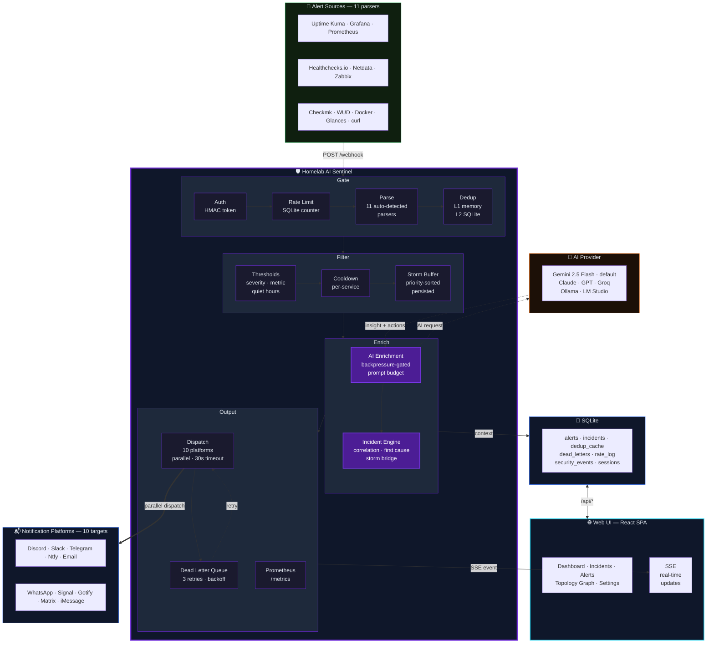

<div align="center">

# 🛡️ Homelab AI Sentinel

### Your monitoring stack fires a webhook. Sentinel fires back with a diagnosis.

[](https://www.python.org/)
[](https://www.docker.com/)
[](LICENSE)
[](https://aistudio.google.com)

</div>

---

## The Hook

A service goes down. Your monitoring tool fires a JSON webhook. Without Sentinel, you get a raw payload — or at best a ping. With Sentinel, you get this:

<table>
<tr>
<td width="50%"><b>📥 Raw Webhook In</b></td>
<td width="50%"><b>📤 AI-Enriched Notification Out</b></td>
</tr>
<tr>
<td>

```json
{
  "monitor": {
    "name": "nginx"
  },
  "heartbeat": {
    "status": 0,
    "msg": "Connection refused"
  }
}
```

</td>
<td>

```
🔴 [CRITICAL] nginx — DOWN

Alert: Connection refused on port 80
Source: Uptime Kuma

🤖 AI Insight
nginx has stopped accepting connections.
This is typically a process crash, a failed
reload after a config change, or port
exhaustion. The clean refusal suggests the
process is not running rather than overloaded.

⚡ Suggested Actions
• systemctl status nginx
• journalctl -u nginx -n 50 --no-pager
• ss -tlnp | grep :80
```

</td>
</tr>
</table>

**The AI never touches your systems.** It reads alert data and outputs text. That's the entire scope of its access.

---

## What It Does

| | |
|---|---|
| 🤖 **Discord Bot Included** | `bot/` — reference Discord bot that connects to any OpenAI-compatible backend (Ollama, LM Studio, OpenAI). Chat, context, `!clear`. Full-featured version with voice, streaming AI, and Claude Code bridge in the [setup guide](#premium-guides). |
| 🔔 **10 Notification Platforms** | Discord · Slack · Telegram · Ntfy · Email · WhatsApp · Signal · Gotify · Matrix · iMessage — configure any combination, all optional |
| 🔍 **11 Alert Source Parsers** | Uptime Kuma · Grafana · Prometheus · Healthchecks.io · Netdata · Zabbix · Checkmk · WUD · Docker Events · Glances · Generic JSON — auto-detected, zero config |
| 🤖 **AI Enrichment** | **Gemini 2.5 Flash** by default (free tier sufficient for homelab volumes) — swap to Claude, GPT-4o, Grok, Groq, or any local model via Ollama/LM Studio/llama.cpp/vLLM |
| 🔒 **Zero System Access** | Stateless and read-only. Sentinel receives JSON, calls an AI API, sends text. The AI cannot restart services, run commands, or read your filesystem |
| 🧪 **Production-Hardened** | HMAC auth · deduplication · global rate limiting · retry/backoff · graceful fallback · SSRF protection · secret redaction · prompt injection detection · security audit log |
| 💸 **Free to Run** | Defaults to Gemini 2.5 Flash (free tier: 10 RPM, 500 req/day) — swap to Claude, GPT-4o, Groq, or run fully local with Ollama or LM Studio — no data leaves your machine |
| 🌐 **Web Dashboard** | Real-time incident timeline, topology view, severity-coded alerts — opt-in, requires DB + password |

---

## Architecture

<details>
<summary><b>🗺️ System Diagram — click to expand</b></summary>

<br>



**Solid lines** — primary data path · **Dotted lines** — AI API call / DLQ retry · **Thick lines** — notification output · **Bidirectional** — Web UI ↔ SQLite

</details>

---

## Feature Tiers — What You're Opting Into

Every feature is opt-in. Sentinel has three independent tiers. Each builds on the previous but you choose how far to go. **We are transparent about what each tier adds to your threat model.**

### Tier 1: Stateless Core (default — no DB, no UI)

**What it does:** Webhook in → parse → threshold filter → AI insight → notification out.

**What you get:** All 11 parsers, all 10 notification platforms, AI enrichment (3 providers + failover), HMAC auth, in-memory dedup (L1), severity/metric/quiet-hour thresholds, storm buffering, watchdog heartbeat, Prometheus metrics, secret redaction, prompt injection detection.

**What you don't get:** Alert history, cross-worker dedup, rate limiting, per-service cooldown, severity escalation, dead letter queue, incidents, web UI.

**Threat model:** Sentinel processes alert payloads in memory and forwards them to AI + notification APIs. Nothing is stored on disk. Attack surface is the `/webhook` endpoint (protect with `WEBHOOK_SECRET`), outbound AI API calls (alert data is sent to your AI provider), and outbound notification calls.

### Tier 2: Stateful (add `DB_PATH`)

**What it adds on top of Tier 1:**

| Feature | What it does | Why it needs DB |
|---|---|---|
| Alert logging | Stores every alert with AI response | Queries the `alerts` table |
| Dedup L2 | Cross-worker and post-restart dedup | Shared `dedup_cache` table |
| Rate limiting | Sliding window request counter | Shared `rate_log` table |
| Per-service cooldown | Suppress repeat notifications | Reads `last_notified_ts` from alerts |
| Severity escalation | Auto-escalate repeated warnings | Counts recent warnings in alerts |
| Dead letter queue | Retry failed notifications | Stores failed dispatches in `dead_letters` |
| Incidents | Group related alerts, track lifecycle | `incidents` table with alert linking |
| Correlation | Link downstream alerts to upstream incidents | Reads open incidents + topology graph |
| Pulse stats | Alert frequency analysis for AI context | Queries alert history (1h/24h/7d) |
| Housekeeper | Auto-prune old data, retry DLQ, WAL checkpoint | Background thread operating on all tables |

**Threat model addition:** A SQLite file on disk contains alert payloads, AI responses, and service names. Anyone with read access to the Docker volume can see your alert history. Protect the volume. Set `RETENTION_DAYS` to limit how much history is retained.

**To disable all Tier 2 features at once:** Set `DB_DISABLED=true`. You don't need to comment out 9 individual settings — one switch turns them all off.

### Tier 3: Web UI (add `UI_PASSWORD` on top of Tier 2)

**What it adds:** Browser dashboard with real-time incident timeline, topology view, alert history, severity-coded status, SSE live updates.

**Threat model addition:** Exposes `/api/*` endpoints with session cookie authentication (HTTP-only, SameSite=Strict). This is a separate auth domain from webhook HMAC — compromising one does not compromise the other. The React SPA makes zero external network calls (no CDN, no analytics, no telemetry). All assets are served from the container.

**Requires:** DB (Tier 2) must be active. Without it, the UI has nothing to display — sessions, incidents, and alert history are all in SQLite. Sentinel will warn you at startup if `UI_PASSWORD` is set but DB is unavailable.

### Dependency Map

```
Tier 1 (Stateless Core)
├── Alert parsing .............. always works
├── Severity thresholds ........ env vars only
├── Quiet hours ................ env vars + system clock
├── Metric thresholds .......... env vars + alert data
├── Dedup L1 (in-memory) ....... always works (per-worker)
├── AI enrichment .............. requires provider API key
│   ├── reactive mode .......... AI key only
│   └── predictive mode ........ AI key (+ DB for history/pulse, degrades without)
├── Storm buffering ............ in-memory (incident linking requires DB)
├── Notification dispatch ...... platform credentials only
├── Topology (AI context) ...... YAML file on disk
├── Runbooks (AI context) ...... markdown files on disk
├── Reverse triage ............. REVERSE_TRIAGE_<SERVICE> scripts on disk
├── Subnet allowlist ........... WHITELIST_SUBNET env var only
├── Watchdog heartbeat ......... URL only
├── Prometheus metrics ......... in-memory counters
└── Webhook auth ............... env var only

Tier 2 (requires DB_PATH)
├── Alert logging
├── Dedup L2 (cross-worker)
├── Rate limiting .............. WEBHOOK_RATE_LIMIT
├── Per-service cooldown ....... COOLDOWN_SECONDS
├── Severity escalation ........ ESCALATION_THRESHOLD
├── Dead letter queue .......... DLQ_MAX_RETRIES
├── Incidents + correlation .... topology file + DB
├── Pulse stats ................ predictive mode + DB
├── Morning brief .............. MORNING_BRIEF_ENABLED + MORNING_BRIEF_TIME
└── Housekeeper

Tier 3 (requires DB_PATH + UI_PASSWORD)
├── /api/* REST endpoints
├── Session auth (SQLite-backed)
├── SSE real-time stream
├── React SPA dashboard
├── Human feedback ............. /api/alerts/<id>/feedback (UI rating buttons)
└── Live SSE topology .......... real-time node state + cascade dimming (UI)
```

---

## Quick Start

```bash
git clone https://github.com/thebadger1337/homelab-ai-sentinel.git
cd homelab-ai-sentinel
cp .secrets.env.example .secrets.env
```

Edit `.secrets.env` — only **`GEMINI_TOKEN`** is required. Get a free key at [aistudio.google.com](https://aistudio.google.com) → Get API key. Add at least one notification platform (e.g. `DISCORD_WEBHOOK_URL`).

```bash
docker compose up -d
```

**Verify:**

```bash
curl -s http://localhost:5000/health
# {
#   "status": "ok",
#   "db": {"total_alerts": 0, "notified_count": 0, "last_alert_ts": null},
#   "ai": {"limit": 10, "used": 0},
#   "security": {},
#   "workers": "1"
# }

curl -s -X POST http://localhost:5000/webhook \
  -H "Content-Type: application/json" \
  -d '{"service": "nginx", "status": "down", "message": "Connection refused on port 80"}'
```

> **After any config or code change:** `docker compose up -d --build` — `restart` reuses the old image and won't pick up changes.

---

## Prerequisites

| Requirement | Notes |
|---|---|
| Docker + Docker Compose | Docker Desktop or the standalone `docker compose` plugin |
| Google AI Studio account | Free — no billing required. [aistudio.google.com](https://aistudio.google.com) |
| At least one notification platform | Configure any of the 10 supported platforms — all are optional |

---

## Environment Variables

### Required (one provider)

| Variable | Description |
|---|---|
| `GEMINI_TOKEN` | Google AI Studio API key *(default provider)*. Get one free at [aistudio.google.com](https://aistudio.google.com) |
| `ANTHROPIC_API_KEY` | Anthropic API key. Requires `AI_PROVIDER=anthropic`. |
| `OPENAI_API_KEY` + `OPENAI_BASE_URL` + `OPENAI_MODEL` | OpenAI-compatible endpoint. Requires `AI_PROVIDER=openai`. |

### Notification Platforms

Configure any combination. All platforms are opt-in — unconfigured platforms are silently skipped.

| Variable | Platform | Notes |
|---|---|---|
| `DISCORD_WEBHOOK_URL` | Discord | Webhook URL for the target channel |
| `SLACK_WEBHOOK_URL` | Slack | Incoming webhook URL |
| `TELEGRAM_BOT_TOKEN` + `TELEGRAM_CHAT_ID` | Telegram | Bot token from BotFather + target chat ID |
| `NTFY_URL` | Ntfy | Topic URL, e.g. `https://ntfy.sh/your-topic` |
| `SMTP_HOST` · `SMTP_PORT` · `SMTP_USER` · `SMTP_PASSWORD` · `SMTP_TO` | Email | SMTP credentials. Port `587` for STARTTLS, `465` for SSL |
| `WHATSAPP_TOKEN` · `WHATSAPP_PHONE_ID` · `WHATSAPP_TO` | WhatsApp | Meta Cloud API token, Phone Number ID, recipient number |
| `SIGNAL_API_URL` · `SIGNAL_SENDER` · `SIGNAL_RECIPIENT` | Signal | Requires `docker compose --profile signal up` to start signal-cli |
| `GOTIFY_URL` + `GOTIFY_APP_TOKEN` | Gotify | Self-hosted Gotify server URL + application token |
| `MATRIX_HOMESERVER` · `MATRIX_ACCESS_TOKEN` · `MATRIX_ROOM_ID` | Matrix | Homeserver URL, bot access token, room ID |
| `IMESSAGE_URL` · `IMESSAGE_PASSWORD` · `IMESSAGE_TO` | iMessage | Bluebubbles server (requires Mac). `IMESSAGE_TO`: phone number or Apple ID email |

To disable a platform without removing its config: `DISCORD_DISABLED=true`. All 10 platforms support `{PLATFORM}_DISABLED`.

### AI Configuration

| Variable | Default | Description |
|---|---|---|
| `AI_PROVIDER` | `gemini` | AI backend: `gemini`, `anthropic`, or `openai` (also covers Ollama, Groq, LM Studio) |
| `GEMINI_MODEL` | `gemini-2.5-flash` | Gemini model name |
| `GEMINI_RPM` | `10` | Gemini max AI calls per minute. Matches free tier. Set `0` to disable. |
| `GEMINI_RETRIES` | `2` | Gemini retries on 429/5xx. Uses exponential backoff. |
| `GEMINI_RETRY_BACKOFF` | `1.0` | Gemini base backoff seconds. Doubles each attempt: 1s → 2s → 4s. |
| `ANTHROPIC_MODEL` | `claude-sonnet-4-20250514` | Anthropic model name |
| `ANTHROPIC_RPM` | `0` | Anthropic max AI calls per minute. `0` disables. |
| `ANTHROPIC_TIMEOUT` | `30` | Anthropic request timeout in seconds |
| `OPENAI_MODEL` | — | Model name as your provider knows it (e.g. `gpt-4o`, `llama3`, `qwen2.5:latest`) |
| `OPENAI_BASE_URL` | — | Base URL (e.g. `http://192.168.1.x:11434/v1` for Ollama) |
| `OPENAI_RPM` | `0` | OpenAI-compat max AI calls per minute. `0` disables (local inference has no quota). |
| `OPENAI_TIMEOUT` | `30` | OpenAI-compat request timeout in seconds |
| `SENTINEL_STRICT_JSON` | `false` | Set to `true` to log which JSON extraction level was used per response (0=clean, 1=fence stripped, 2=substring, 3=regex). Useful when tuning local model prompts to produce cleaner output. |

### Operating Mode

| Variable | Default | Description |
|---|---|---|
| `SENTINEL_MODE` | `predictive` | `minimal` — parse and dispatch, no AI call · `reactive` — AI insight per alert, no history · `predictive` — AI insight + recent alert history injected into prompt (history requires DB) |
| `SENTINEL_CONTEXT` | — | Describe your infrastructure once — used in every AI prompt for more specific analysis. E.g. `"3-node Proxmox cluster, nginx on node2, TrueNAS on node3, all on 192.168.1.0/24"` |
| `SENTINEL_CONTEXT_FILE` | `/data/context.md` | Path to a context file (alternative to `SENTINEL_CONTEXT` env var). Mount via Docker volume for multi-line descriptions. Env var takes priority if both are set. |
| `ESCALATION_THRESHOLD` | `0` | Auto-escalate warning→critical after N warnings for the same service within `ESCALATION_WINDOW`. `0` disables. **Requires DB.** |
| `ESCALATION_WINDOW` | `3600` | Time window in seconds for escalation counting. Default: 1 hour. |
| `RUNBOOK_DIR` | `/data/runbooks` | Directory containing per-service runbook files. Create `nginx.md`, `postgres.md`, etc. — matched case-insensitively against the service name. Content is injected into the AI prompt for specific remediation. Also the default location for `topology.yaml`. |
| `TOPOLOGY_FILE` | `{RUNBOOK_DIR}/topology.yaml` | Path to a YAML service dependency graph. When present, the AI considers upstream/downstream impact for cascade failure analysis. See [Topology Mapping](#topology-mapping). |
| `ACTIONS_FILE` | `{RUNBOOK_DIR}/actions.yaml` | Path to operator-defined runnable scripts for the action proxy. See [Action Proxy](#action-proxy). |
| `SHADOWS_FILE` | `{RUNBOOK_DIR}/shadows.yaml` | Path to expected-heartbeat declarations. See [Synthetic Shadowing](#synthetic-shadowing). |
| `SHADOW_CHECK_INTERVAL` | `60` | How often (in seconds) the shadow checker scans for silent services. |
| `COOLDOWN_SECONDS` | `0` | Per-service notification cooldown. After notifying for a service, suppress further notifications for that service for N seconds regardless of message content. `0` disables. Different from dedup (exact match only). **Requires DB.** |

### Storm Intelligence

| Variable | Default | Description |
|---|---|---|
| `STORM_WINDOW` | `0` | Buffer window in seconds. When > 0, non-recovery alerts are held for this duration. If enough accumulate, Sentinel sends one combined AI analysis instead of N individual calls. `0` disables. |
| `STORM_THRESHOLD` | `3` | Minimum alerts in the buffer to trigger storm mode. Below this, buffered alerts are processed individually after the window closes. |

### Watchdog

| Variable | Default | Description |
|---|---|---|
| `WATCHDOG_URL` | — | URL to ping periodically. If Sentinel hangs or crashes, the missed heartbeat alerts you via external monitoring (Healthchecks.io, Uptime Kuma, etc.). |
| `WATCHDOG_INTERVAL` | `300` | Seconds between heartbeat pings. Minimum 10. |

### Morning Brief

| Variable | Default | Description |
|---|---|---|
| `MORNING_BRIEF_ENABLED` | `false` | Set to `true` to send a daily AI digest each morning. **Requires DB.** |
| `MORNING_BRIEF_TIME` | `07:00` | Time to send the brief (24-hour HH:MM). Sentinel uses the `QUIET_HOURS` window as the review period; falls back to the previous 8 hours if `QUIET_HOURS` is not set. |

The brief queries the alert DB for the review window, calls the AI with a structured prompt, and dispatches to all configured notification platforms as a synthetic `morning_brief` alert. If dispatch fails, the send is not recorded and will be retried the next day. If no alerts occurred in the window, the brief is skipped silently.

### Reverse Triage

| Variable | Default | Description |
|---|---|---|
| `REVERSE_TRIAGE_<SERVICE>` | — | Absolute path to a diagnostic script for a service. Replace `<SERVICE>` with the normalized service name: uppercase, spaces and hyphens → underscores. E.g. `REVERSE_TRIAGE_NGINX=/opt/triage/nginx.sh`. The script receives `service_name` and `severity` as positional arguments and must exit `0`. Stdout (up to 2000 chars) is injected into the AI prompt as the highest-priority context section. |
| `REVERSE_TRIAGE_TIMEOUT` | `10` | Max seconds a triage script may run. Scripts that exceed this are killed and their output is discarded. |

Scripts are run with a completely blank environment — Sentinel API keys, tokens, and credentials are not accessible. Output is XML-escaped before prompt insertion to prevent tag injection. Only runs on non-recovery alerts; recovery alerts skip triage.

### Security & Rate Limiting

| Variable | Default | Description |
|---|---|---|
| `WHITELIST_SUBNET` | — | Comma-separated CIDR networks allowed to POST to `/webhook`. Requests from IPs outside all listed networks receive 403 and are logged to the security audit. Example: `192.168.1.0/24` or `192.168.0.0/16,10.0.0.0/8`. Fail-open: a malformed CIDR entry is skipped with a warning, not treated as "block all". |
| `WEBHOOK_SECRET` | — | Shared secret for `X-Webhook-Token` header auth. Recommended for internet-facing deployments. Generate: `openssl rand -hex 32` |
| `WEBHOOK_RATE_LIMIT` | `0` | Max requests per `WEBHOOK_RATE_WINDOW` seconds. `0` disables. **Requires DB.** |
| `WEBHOOK_RATE_WINDOW` | `60` | Sliding window size in seconds. |
| `DEDUP_TTL_SECONDS` | `60` | Suppress identical alerts within this window. `0` disables. L1 (in-memory) always works. L2 (cross-worker) **requires DB.** |
| `DB_PATH` | `/data/sentinel.db` | Path to SQLite database. Set to a writable path to enable all Tier 2 features. |
| `DB_DISABLED` | `false` | Set to `true` to explicitly disable the DB and all Tier 2/3 features at once. |
| `UI_PASSWORD` | — | Set to enable the Web UI (Tier 3). **Requires DB.** |

### Performance Tuning

| Variable | Default | Description |
|---|---|---|
| `WORKERS` | cpu+1 | Gunicorn worker processes. Auto-detected. |
| `WORKER_THREADS` | `4` | Threads per worker. Each thread handles one concurrent request. |
| `GUNICORN_TIMEOUT` | `60` | Worker kill timeout. Must exceed worst-case request time (~48s with default retries). If you raise `GEMINI_RETRIES` or `GEMINI_RETRY_BACKOFF`, raise this too. |
| `GUNICORN_MAX_REQUESTS` | `1000` | Recycle workers after N requests. Prevents memory growth. |
| `GUNICORN_ACCESS_LOG` | — | Set to `"-"` to write per-request access logs to stdout. |
| `PORT` | `5000` | Port Sentinel binds to inside the container. |
| `SENTINEL_DEBUG` | `false` | Verbose logging — full parsed alert, AI response, per-platform results. Never enable in production. |

---

## Alert Sources

Auto-detected from the payload — no configuration required. Point any monitoring tool at `http://your-host:5000/webhook`.

| Source | Detection Fields |
|---|---|
| **Uptime Kuma** | `heartbeat` + `monitor` |
| **Grafana Unified Alerting** | `alerts` array + `orgId` |
| **Prometheus Alertmanager** | `alerts` array + `receiver` + `groupLabels` (no `orgId`) |
| **Healthchecks.io** | `check_id` + `slug` |
| **Netdata** | `alarm` + `chart` + `hostname` |
| **Zabbix** | `trigger_name` + `trigger_severity` |
| **Checkmk** | `NOTIFICATIONTYPE` + `HOSTNAME` (ALL_CAPS keys) |
| **WUD (What's Up Docker)** | `updateAvailable` + `image` |
| **Docker Events / Portainer** | `Type` + `Action` + `Actor` (capital keys) |
| **Glances** | `glances_host` + `glances_type` (via poller sidecar — see below) |
| **Generic JSON** | Any payload — looks for `service`/`name`, `status`/`state`, `message`/`msg` |

Any tool that POSTs JSON works via the generic parser. Extra fields are passed to the AI as context — more detail means better analysis.

### Quick Wiring

**Uptime Kuma:** Settings → Notifications → Webhook → `http://your-host:5000/webhook`

**Grafana:** Alerting → Contact points → Webhook → `http://your-host:5000/webhook`

**Prometheus Alertmanager:**
```yaml
receivers:
  - name: sentinel
    webhook_configs:
      - url: http://your-host:5000/webhook
```

**Glances** (pull-based — use the included poller sidecar):
```bash
GLANCES_URL=http://your-glances-host:61208 \
SENTINEL_URL=http://your-host:5000/webhook \
python3 scripts/glances_poller.py
```

<details>
<summary>Glances poller as a Docker service</summary>

```yaml
services:
  glances-poller:
    image: python:3.12-slim
    command: sh -c "pip install requests --quiet && python /app/glances_poller.py"
    volumes:
      - ./scripts/glances_poller.py:/app/glances_poller.py:ro
    environment:
      - GLANCES_URL=http://your-glances-host:61208
      - SENTINEL_URL=http://homelab-ai-sentinel:5000/webhook
      - POLL_INTERVAL=30
      # SENTINEL_SECRET=your-webhook-secret
      # GLANCES_HOST_LABEL=my-server
```

</details>

---

## Switching AI Providers

All three AI providers live in a single file: `app/llm_client.py`. Set `AI_PROVIDER` in `.secrets.env` plus the provider's env vars — that's it. Everything else (all 11 parsers, all 10 notification clients, rate limiting, deduplication) is untouched.

| Provider | Free Tier | Config |
|---|---|---|
| **Gemini 2.5 Flash** *(default)* | ✅ | `GEMINI_TOKEN` — 10 RPM, 500 req/day free tier |
| **Claude (Anthropic)** | ❌ | `AI_PROVIDER=anthropic` `ANTHROPIC_API_KEY=sk-ant-...` |
| **OpenAI (GPT-4o)** | ❌ | `AI_PROVIDER=openai` `OPENAI_BASE_URL=https://api.openai.com/v1` `OPENAI_API_KEY=sk-...` |
| **Ollama** | ✅ | `AI_PROVIDER=openai` `OPENAI_BASE_URL=http://your-host:11434/v1` `OPENAI_MODEL=llama3` |
| **LM Studio / LocalAI** | ✅ | `AI_PROVIDER=openai` `OPENAI_BASE_URL=http://your-host:1234/v1` |
| **Groq** | ✅ | `AI_PROVIDER=openai` `OPENAI_BASE_URL=https://api.groq.com/openai/v1` |

The [setup guides](#premium-guides) cover provider-specific gotchas, exact error messages, and troubleshooting for each provider.

---

## Topology Mapping

Define your service dependency graph so the AI can reason about cascade failures. When nginx goes down, the AI knows nextcloud and gitea depend on it.

Create `topology.yaml` in your `RUNBOOK_DIR` (default: `/data/runbooks/`), or set `TOPOLOGY_FILE` to an explicit path:

```yaml
services:
  nginx:
    depends_on: [docker]
    host: node2
    description: Reverse proxy for all web services

  postgres:
    depends_on: [docker]
    host: node1
    description: Primary database

  nextcloud:
    depends_on: [nginx, postgres, redis]
    host: node1

  redis:
    depends_on: [docker]
    host: node1
    description: Session cache

  gitea:
    depends_on: [nginx, postgres]
    host: node2

  docker:
    depends_on: []
    host: node1
    description: Container runtime
```

You only declare `depends_on` — Sentinel derives the reverse relationships automatically. Service names are matched case-insensitively against what your monitoring tools report. The `host` and `description` fields are optional but give the AI more context.

The topology is loaded once on first request and cached for the process lifetime. Restart the container to pick up changes.

---

## Synthetic Shadowing

Define expected heartbeat intervals so Sentinel pages you even when your monitoring tool goes silent. Put `shadows.yaml` in your runbook directory (or set `SHADOWS_FILE`):

```yaml
shadows:
  ping_monitor:
    interval: 300         # alert if no webhook received in 5 minutes
    severity: warning     # warning (default) or critical
    description: "Uptime Kuma ping monitor — expected every 5 minutes"

  database_backup:
    interval: 3600
    severity: critical
    description: "Nightly backup job — must report within 1 hour"
```

The shadow checker runs every `SHADOW_CHECK_INTERVAL` seconds (default: 60). When a service has been silent longer than its interval:

1. Sentinel checks whether an open incident already exists for that service (avoids duplicate alerts across restarts)
2. If no open incident: fires a synthetic alert through the normal AI enrichment + notify pipeline
3. When the real service resumes and sends a webhook, that alert links to the existing incident — the operator resolves it from the UI

Services with no prior alert history are given a full grace period on startup to avoid false positives immediately after a restart.

---

## Action Proxy

Define operator-approved runnable scripts in `actions.yaml` (inside `RUNBOOK_DIR`, or override with `ACTIONS_FILE`). When an alert fires, Sentinel queues all matching actions as pending. Open the **Actions** page in the web UI to approve or reject each one.

```yaml
actions:
  restart_nginx:
    description: "Restart nginx service"
    command: ["systemctl", "restart", "nginx"]
    timeout: 15           # seconds, default 30
    services: ["nginx"]   # optional — omit to apply to all services

  disk_check:
    description: "Report disk usage"
    command: "df -h"      # string is split on whitespace
    # no services filter → queued on every alert
```

**Security guarantees:**
- Commands run with `shell=False` — no shell expansion or injection
- Subprocess inherits an **empty environment** — no secrets from `.secrets.env` can leak into the child process
- stdout + stderr are capped at 4 096 characters before storage
- Only UI-authenticated operators can approve or reject actions
- Duplicate queuing is suppressed — if a `restart_nginx` action is already pending, a second alert for nginx does not add another

---

## Security

See [SECURITY.md](SECURITY.md) for the full threat model, data flow, secrets handling, Docker isolation, and a Security Architecture FAQ that answers auditor questions without reading the source.

**Pre-deployment checklist:**
- `.secrets.env` is gitignored — verify with `git check-ignore -v .secrets.env`
- Set `WEBHOOK_SECRET` for any deployment reachable outside localhost — this also gates `/health`
- Alert payloads are sent to cloud AI — avoid including passwords, PII, or regulated data in monitored service names or messages
- Never set `FLASK_DEBUG=1` in production
- Monitor `/health` → `security` for rising `auth_failure` or `injection_detected` counts

---

## Running Tests

Tests are not included in the repository — they reference real network fixtures and service endpoints, so they only pass against the author's homelab environment. See [SECURITY.md](SECURITY.md) for the full security architecture, threat model, and design decisions.

---

## Premium Guides

**Every Sentinel feature is open-source and included in this repo.** The README gets you to a working deployment. The guides cover what comes after — production gotchas, exact error messages and fixes, setup steps that aren't in any official documentation, and extended integrations like the full-featured Discord bot with voice, streaming AI, and Claude Code bridge. The guides provide detailed walkthroughs and implementations that build on top of Sentinel.

**Platform Setup Guides** — what to configure and what fails silently:

| Guide | What it covers | Price |
|---|---|---|
| WhatsApp Cloud API | Meta Business setup, 24hr message window, silent auth errors | $12 |
| Signal | signal-cli-rest-api, QR linking, the one step that fails silently | $12 |
| Matrix (Conduit) | Self-hosted homeserver, Android HTTP block, `server_name` permanence | $12 |
| Discord (3-in-1) | Webhook alerts · full reference bot with streaming AI and tool calls · Claude Code bridge | $12 |
| Telegram | BotFather, mobile-only `/start` requirement, chat ID retrieval | $9 |
| Gotify | Self-hosted push server, Android app setup, priority levels, self-signed cert handling | $9 |
| Slack | Incoming webhook setup, Block Kit format, mention injection prevention | $9 |
| Ntfy | Topic setup, basic auth for locked instances, priority and tag mapping | $6 |
| Email (SMTP) | Gmail app passwords, STARTTLS config, HTML and plain-text bodies | $6 |

**Alert Source Guides** — wiring your monitoring tools to Sentinel:

| Guide | Price |
|---|---|
| Alert Sources Pack — all 10 monitor guides | $22 |
| Uptime Kuma · Grafana · Prometheus · Healthchecks.io · Docker Events · Generic JSON | $5 each |
| Netdata · Glances | $6 each |
| Checkmk | $8 |
| Zabbix | $9 |

**Technical Guides:**

| Guide | What it covers | Price |
|---|---|---|
| Complete Setup Guide | Full production deployment walkthrough — every real error and fix | $9 |
| LLM Provider Swap | Drop-in code for Claude, GPT-4o, Groq, Mistral, Ollama, LM Studio | $9 |

**Bundles:**

| Bundle | Includes | Price |
|---|---|---|
| Messaging Power Pack | WhatsApp + Signal + Telegram + Matrix | $39 |
| Self-Hosted Stack | Gotify + Matrix + Ntfy + Discord | $24 |

All guides: [sercrat.gumroad.com](https://sercrat.gumroad.com/)

---

## Roadmap

**v1.0 — complete:**
- 11 alert source parsers · 10 notification platforms · parallel dispatch via `ThreadPoolExecutor`
- HMAC auth · deduplication · webhook rate limiter · AI RPM limiter
- AI retry with exponential backoff · gthread Gunicorn workers

**v1.1 — complete:**
- SSRF protection · pattern-based secret redaction · IPv6 loopback hardening
- O(k) dedup pruning · dedup memory cap · deque-based rate limiter
- Non-root container user · pip hash pinning · unhandled exception URL-safe logging
- Per-service severity thresholds (`MIN_SEVERITY`, `THRESHOLD_<SERVICE>`)
- Metric-based thresholds (`METRIC_THRESHOLD_<KEY>`) — suppress below a configured % floor
- Quiet hours (`QUIET_HOURS`, `QUIET_HOURS_MIN_SEVERITY`)
- Persistent SQLite alert log (WAL mode, named Docker volume)
- Alert history injected into AI prompt — pattern detection across recurring failures

**v1.2 — complete:**
- URL defanging in AI output — `http(s)[://]` prevents auto-linking from injection attempts
- Global webhook rate limiter — SQLite-backed, shared across all Gunicorn workers
- Prompt injection detection — pattern scan on alert fields before the AI call; logs to DB
- Security event audit log — `security_events` table for auth failures, rate limit hits, detections
- `/health` enrichment — DB stats, AI RPM state, security event counts (24h), worker count
- `/health` authentication — gated by `WEBHOOK_SECRET` when set
- Security Architecture FAQ in SECURITY.md — walkable answers to auditor questions

**v1.3 — complete:**
- Prompt context injection (`SENTINEL_CONTEXT`) — describe your infrastructure once, used in every AI prompt
- Homelab Pulse — pre-computed frequency stats (1h/24h/7d) injected into AI prompt
- Severity escalation — N warnings in a time window auto-escalate to critical (`ESCALATION_THRESHOLD`, `ESCALATION_WINDOW`)
- Runbook injection — map service names to markdown files (`RUNBOOK_DIR`) for specific remediation steps
- Unified LLM client — Gemini, Anthropic, and OpenAI-compatible providers in a single `app/llm_client.py`
- Per-service notification cooldown (`COOLDOWN_SECONDS`) — suppress repeat notifications beyond dedup TTL
- Resolution verification — on recovery, AI summarizes the preceding outage with a dedicated prompt
- Watchdog heartbeat (`WATCHDOG_URL`) — periodic ping to external monitoring; alerts if Sentinel hangs

**v1.4 — complete:**
- Topology mapping — YAML dependency graph (`topology.yaml`) injected into AI for cascade failure analysis
- Storm intelligence — buffer correlated alerts within a time window, single batch AI analysis + combined notification (`STORM_WINDOW`, `STORM_THRESHOLD`)
- Shared resources in topology — correlate failures to common hardware (storage arrays, network segments)
- OpenAI-compatible universal connector — one config for OpenAI, Grok, Groq, Ollama, LM Studio, llama.cpp, vLLM
- AI provider failover (`AI_PROVIDER_FALLBACK`) — automatic fallback when primary provider fails

**v1.5 — complete:**
- State persistence — SQLite-backed L2 dedup cache (cross-worker, survives restarts)
- Dead letter queue — retry failed notifications with exponential backoff (5min/15min/45min)
- Prometheus metrics endpoint (`GET /metrics`) — thread-safe counters, no external deps
- Universal secret redaction — JWTs, inline creds, emails redacted across all 11 parsers
- AI backpressure — `threading.Semaphore` limits concurrent AI calls, prevents thread starvation
- Priority storm buffer — critical alerts processed first when buffer flushes below threshold
- Configurable prompt budget (`MAX_PROMPT_CHARS`) — cap token spend per AI call

**v2.0 — complete:**
- Schema versioning — `_MIGRATIONS` list applies incremental DDL on startup
- Incident engine — group related alerts, track lifecycle (open → resolved), first cause detection
- Correlation engine — topology-based alert linking (structural, not AI-inferred)
- Storm-to-incident bridge — storm flushes create incidents and link all buffered alerts
- Web UI — React SPA (Vite + Tailwind CSS) with real-time SSE, session auth, incident timeline, topology view
- SQLite-backed sessions — cross-worker session persistence for multi-process Gunicorn
- Feature modularity — every feature is truly opt-in across three tiers (stateless / DB / UI)
- `DB_DISABLED=true` — one switch disables all DB-dependent features
- Transparent startup logging — warns about every configured feature that's inactive without DB
- Accurate dispatch counting — unconfigured platforms skipped, not counted as successes
- Tested against real homelab fixtures (tests not included — see Running Tests)

**v2.1 — complete:**
- Morning brief — scheduled AI digest of quiet-hours activity sent each morning (`MORNING_BRIEF_ENABLED`, `MORNING_BRIEF_TIME`); uses `QUIET_HOURS` window or falls back to the previous 8 hours; dispatched to all configured notification platforms as a synthetic alert; double-send-guarded via DB
- Human feedback loop — thumbs-up / meh / thumbs-down ratings on AI insights from the web UI (`POST /api/alerts/<id>/feedback`); exportable dataset via `GET /api/feedback/export` for offline fine-tuning or prompt analysis
- Reverse triage — operator-configured diagnostic scripts run per service at alert time (`REVERSE_TRIAGE_<SERVICE>`); stdout injected as live context into the AI prompt; scripts run with a blank environment so no Sentinel secrets leak; output capped at 2000 chars, timeout configurable via `REVERSE_TRIAGE_TIMEOUT`

**v2.2 — complete:**
- `WHITELIST_SUBNET` — IP allowlist gate on the webhook endpoint (comma-separated CIDR networks, e.g. `192.168.1.0/24,10.0.0.0/8`); blocked IPs logged to security audit; fail-open on malformed entries so a bad CIDR string never silently locks you out
- Live SSE topology — real-time node state on the topology map without page reload: alerting nodes glow with their severity colour, cascade-impacted downstream services dim with a warning icon, dependency edges animate to trace the failure propagation path

**v2.3 — complete:**
- Strict JSON extraction — four-level fallback chain in `_extract_json()`: direct parse → markdown fence strip → substring extraction → regex field recovery. Local models that wrap responses in prose or markdown no longer produce silent failures. `SENTINEL_STRICT_JSON=true` logs which extraction level fired for prompt-tuning diagnostics.

**v2.4 — complete:**
- Action proxy — define runnable scripts in `actions.yaml` (in your runbook directory). When an alert fires, applicable actions are queued automatically. Operators approve or reject each action from the web UI; approved actions run via subprocess in a blank environment (no secret leakage) and their output is shown inline. `ACTIONS_FILE` env var overrides the default path.

**v2.5 — complete:**
- Synthetic shadowing — define expected heartbeat intervals per service in `shadows.yaml`. When a watched service stops sending webhooks for longer than its configured interval, Sentinel fires a synthetic alert through the normal notify + AI pipeline so the operator is paged even when the monitoring tool itself is silent. Uses the incidents table to avoid re-firing after an open incident is already created. `SHADOWS_FILE` and `SHADOW_CHECK_INTERVAL` env vars.

**Planned:**
- Nagios, LibreNMS, Proxmox VE, TrueNAS, Home Assistant parsers
- Teams, Pushover, PagerDuty notification targets

---

## Frequently Asked Questions

### What is Homelab AI Sentinel?

Homelab AI Sentinel is an AI-powered webhook receiver for homelab monitoring. Your monitoring tool (Uptime Kuma, Grafana, Prometheus, Zabbix, etc.) sends an alert webhook. Sentinel parses it, sends the alert data to an AI model, and forwards an enriched notification — with a plain-English diagnosis and specific commands to run first — to your chosen notification platform (Discord, Slack, Telegram, etc.).

### How is Sentinel different from just using a Discord webhook directly?

A raw webhook posts a JSON blob or a basic "service X is down" message with no context. Sentinel adds: an AI-generated diagnosis of the probable cause, specific remediation commands tailored to your service, cascade failure analysis (if topology is configured), and incident grouping so a five-service outage creates one incident instead of five separate alerts. The raw webhook tells you something is down. Sentinel tells you why and what to check first.

### Does Sentinel have access to my servers?

No. Sentinel is stateless and read-only. It receives JSON payloads sent by your monitoring tool and forwards text to your notification platforms. It cannot SSH into your servers, run commands, read your filesystem, or take any action on your infrastructure. The AI model sees only the alert payload you send it.

### What AI providers does Sentinel support?

Gemini 2.5 Flash (default, free tier), Anthropic Claude (Haiku, Sonnet, Opus), OpenAI GPT-4o and GPT-4o-mini, Groq (fast free tier), Mistral, Together AI, Ollama (local, fully air-gapped), LM Studio (local), any OpenAI-compatible endpoint including llama.cpp and vLLM. Switch providers by setting `AI_PROVIDER` in `.secrets.env`. No code changes required.

### Can I run Sentinel fully locally with no data leaving my machine?

Yes. Set `AI_PROVIDER=ollama` and `OLLAMA_BASE_URL=http://your-ollama-host:11434` and `OLLAMA_MODEL=llama3.2` (or any pulled model). Alert data is processed entirely on your hardware. No external API calls. Combine with `DB_DISABLED=true` for a fully stateless local pipeline.

### What monitoring tools does Sentinel work with?

Uptime Kuma (all versions), Grafana (alertmanager-style webhooks), Prometheus Alertmanager, Healthchecks.io, Netdata, Zabbix, Checkmk, Glances, Docker Events (via webhook relay), WUD (What's Up Docker), and any tool that can POST JSON to an HTTP endpoint (generic parser auto-detects format). New parsers can be added in `app/alert_parser.py`.

### How is Sentinel different from Alertmanager?

Alertmanager is a routing and grouping layer for Prometheus alerts — it silences, inhibits, and routes alerts to receivers. Sentinel is an enrichment layer that sits downstream of any monitoring tool: it adds AI diagnosis, runbook injection, topology-aware cascade analysis, and incident tracking. They serve different purposes and can be used together — point an Alertmanager webhook receiver at Sentinel.

### Do I need a paid AI subscription?

No. Gemini 2.5 Flash has a free tier (10 RPM, 500 req/day as of v2.0) that is sufficient for most homelab alert volumes. Groq also has a generous free tier (~30 RPM). Ollama and LM Studio are free if you run your own hardware.

### What happens if the AI API is unavailable or rate-limited?

Sentinel degrades gracefully. If the AI call fails, returns a 429, or times out, the alert is still dispatched to all configured notification platforms — without the AI insight section. You get the raw alert data plus a brief note that AI analysis was unavailable. The alert is never silently dropped because of an AI failure.

### How does deduplication work?

Sentinel has two dedup layers. L1 is an in-memory cache (per-worker, lost on restart) — fast, zero disk I/O. L2 is a SQLite-backed cache (shared across workers, survives restarts) — enabled when `DB_PATH` is set. Dedup is keyed on service name + status + source. The TTL is configurable (`DEDUP_TTL_SECONDS`, default: 300s). An alert that fires repeatedly every 30 seconds during an outage fires once, not dozens of times.

### Can Sentinel group related alerts into a single notification?

Yes, two ways. **Storm mode** (`STORM_WINDOW`, `STORM_THRESHOLD`) buffers alerts that arrive within a short time window and sends one combined AI analysis when the window closes. **Incident engine** (requires DB) groups structurally related alerts (based on topology dependencies) into incidents with a lifecycle — open, correlated, resolved — and generates a resolution summary when all linked alerts recover.

### What is topology mapping?

Topology mapping lets you define a service dependency graph in a YAML file. When nginx goes down and nextcloud also starts alerting, Sentinel knows nextcloud depends on nginx and includes cascade analysis in the AI prompt. The AI can then reason: "nextcloud failure is likely caused by the upstream nginx outage" rather than treating each alert independently. Configured via `TOPOLOGY_FILE` pointing to a `topology.yaml`.

### Can I inject custom context into the AI prompt?

Yes. `SENTINEL_CONTEXT` is a free-text string injected into every AI prompt. Use it to describe your infrastructure: hardware specs, OS, key services, network layout. This turns generic AI responses into responses that know your specific environment. Example: `SENTINEL_CONTEXT=Ubuntu 22.04, 4-node Docker swarm, nginx reverse proxy, Postgres on node1, Redis on node2`.

### What are runbooks and how do I use them?

Runbooks are markdown files you write that describe how to handle specific service failures. Set `RUNBOOK_DIR` to a folder and create files named after your services (e.g. `nginx.md`, `postgres.md`). When an alert fires for that service, Sentinel appends the matching runbook content to the AI prompt — so the AI has your specific recovery steps, not just generic advice.

### Does Sentinel work with multiple notification platforms simultaneously?

Yes. Configure any combination of the 10 supported platforms: Discord, Slack, Telegram, Ntfy, Email, WhatsApp (Cloud API), Signal (signal-cli), Gotify, Matrix, and iMessage (macOS only). Each platform is independent and opt-in. If one platform fails to deliver, the others are not affected, and the failed delivery is queued in the dead letter queue for retry.

### What is the dead letter queue?

When a notification dispatch fails (network error, platform API down, rate limited), Sentinel stores the failed delivery in a SQLite `dead_letters` table. A background housekeeper retries at 5 minutes, 15 minutes, and 45 minutes. After three failures, the entry is marked permanently failed and preserved for inspection. This prevents alert loss during brief platform outages without silent retry loops.

### How do I set up HMAC authentication?

Set `WEBHOOK_SECRET` in `.secrets.env`. Sentinel will then require all incoming webhooks to include a valid HMAC-SHA256 signature in the `X-Sentinel-Signature` header. Uptime Kuma supports this natively (set the secret in the notification settings). For other tools, use a proxy or set the header manually. If `WEBHOOK_SECRET` is set, `/health` is also gated — pass the secret as `Authorization: Bearer <secret>`.

### What does the web UI show?

The web UI requires `DB_PATH` to be set. Once the DB is enabled, navigate to `http://your-host:5000/` in a browser — if no password has been configured yet, Sentinel shows a first-run setup screen where you can set the password directly in the UI without touching `.secrets.env`. You can also pre-configure it by setting `UI_PASSWORD` in `.secrets.env` before starting the container.

The dashboard is a React SPA served from the Sentinel container with no external dependencies. It shows: live dashboard with alert and incident stats, incident timeline with linked alert history and AI summaries, full alert log with delete controls, interactive topology graph (if `TOPOLOGY_FILE` is set), and operator notes per alert/incident. Real-time updates via SSE — no polling, no page refresh needed.

### Can I use Sentinel as an MCP server?

Yes. The `sentinel_mcp/` directory in this repo contains an MCP server that wraps Sentinel's read API. Install it (`pip install homelab-ai-sentinel-mcp`), configure `SENTINEL_URL` and optionally `SENTINEL_TOKEN`, and add it to Claude Desktop or Claude Code. You can then ask Claude "what alerts fired overnight?" or "are there any open incidents?" directly in the chat interface. See `sentinel_mcp/README.md` for setup instructions.

### Is Sentinel open source? Can I modify it?

Yes. MIT license — use it, modify it, self-host it, and redistribute it. The only restriction is that the MIT license notice must be preserved. There is no telemetry, no phone-home, and no dependency on any Sentinel-hosted service. Premium setup guides are sold separately on Gumroad but are documentation, not code — the core software is fully functional without them.

---

## Community

- **GitHub Issues** — bug reports and feature requests
- **GitHub Discussions** — deployment help, share your setup

---

## License

MIT — see [LICENSE](LICENSE).
